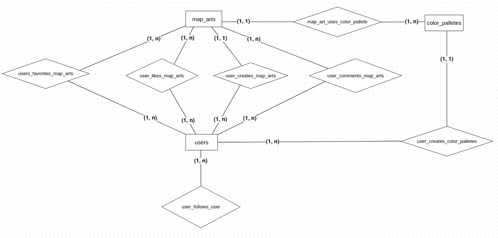
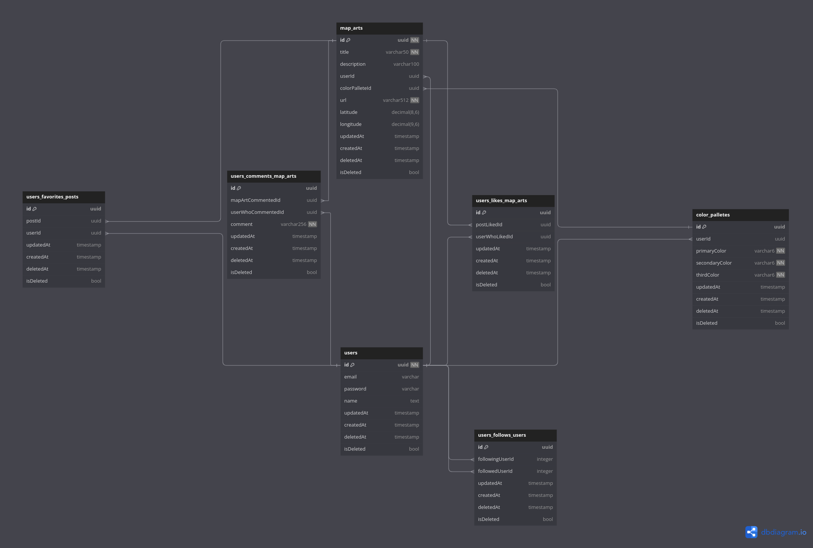

# 1. Motivação

No semestre 2023.2, fiz a disciplina HACB12 - Laboratório de Arte e Interfaces. Nela, eu criei um pequeno projeto para
gerar artes utilizando a geolocalização do usuário e uma paleta de cores. O projeto consiste em pegar uma imagem
estática utilizando a API do [Mapbox](https://www.mapbox.com/) e então manipular os pixels da imagem utilizando o [Processing](https://processing.org/).
Entretanto, esse projeto foi feito inicialmente para funcionar em um browser e depois fiz um aplicativo android que funciona totalmente com um banco de dados local.
Meu objetivo, é criar um sistema completo e open source para esse projeto, onde as pessoas poderão, além de criar artes nos seus celulares android, interagir com as artes de outras pessoas.

# 2. Requisitos Funcionais

### RF1 -  Cadastro de usuário

 Uma pessoa deve conseguir se cadastrar no sistema utilizando um e-mail e senha, onde esse e-mail será único por usuário.
 Além do e-mail e senha, o usuário deve também fornecer um nome para finalizar o cadastro.
 
### RF2 - Login de usuário

Um usuário já cadastrado no sistema, deve conseguir acessar sua conta utilizando seu e-mail e sua senha informados no
momento do cadastro.

### RF3 - Criar uma paleta de cores

Um usuário logado no sistema, poderá criar paletas de cores para utilizar nas suas artes. Essa paleta deve possuir 3 cores, um nome e também
poderão ser utilizadas por outros usuários.

### RF4 - Criar uma arte de mapa

Um usuário logado no sistema deve conseguir criar uma nova arte. Para isso, ele precisa fornecer sua localização atual,
que será coletada utilizando o SDK do Android. Com a latitude e longitude do usuário, faremos uma busca na API do Mapbox e então
manipularemos os pixels da imagem do mapa com base em uma paleta de cores escolhida pelo usuário. Utilizaremos algum serviço em nuvem
para armazenamento das imagens criadas pelo usuário, esse serviço retornará a URL da imagem criada pelo usuário, que será salva no banco de dados
juntamente com outras informações relativas a imagem, como tamanho e a localidade.

### RF5 - Deletar uma arte de mapa

O usuário também poderá deletar uma arte que já foi criada, caso ele não goste da paleta de cores que utilizou ou simplesmente não queira mais
ter aquela arte no seu perfil.

### RF6 - Perfil de usuário

Todo usuário vai possuir um perfil próprio. Esse perfil vai listar todas as paletas de cores criadas pelo usuário e também
todas as artes criadas por esse usuário.

### RF7 - Buscar um perfil de usuário

Todo usuário vai poder buscar o perfil de um outro usuário e visualizar suas paletas ou artes criadas.

### RF8 - Curtir uma arte de mapa

Todo usuário poderá curtir uma arte de mapa criada por outro usuário.

### RF9 - Comentar uma arte de mapa

Todo usuário poderá comentar uma arte de mapa criada por outro usuário.

### RF10 - Favoritar uma arte de mapa

Todo usuário poderá favoritar artes criadas criadas por outro usuário.

### RF11 - Listar artes favoritas

O usuário terá uma tela onde ele poderá ver uma listagem de todas as suas artes de mapa favoritadas.

# 3. Delimitação do Minimundo para o Banco de dados:

### Usuários (_users_)

- **id** [uuid, primary key, not null]: Identificador único de um usuário.
- **email** [string, 50 caracteres]: Email único de um usuário.
- **password** [string, 128 caracteres]: Senha criptografada de um usuário.
- **name** [string, 60 caracteres]: Nome de um usuário.
- **updatedAt** [timestamp]: Indicador de tempo para sempre que uma entrada sofre alteração.
- **createdAt** [timestamp, not null]: Indicador de quando a entrada foi criada.
- **deletedAt** [timestamp, default: null]: Indicador de quando o soft-delete da entrada foi realizado.
- **isDeleted** [bool, default: false]: Indicador de deleção de uma entrada (soft-delete)

### Paletas de cores (_color_palletes_)

- **id** [uuid, primary key, not null]: Identificador único de uma paleta de cores.
- **userId** [uuid, foreign key, not null]: Identificador do usuário criador dessa paleta de cores.
- **primaryColor** [string, 6 caracteres]: Código hexadecimal da cor primária.
- **secondaryColor** [string, 6 caracteres]: Código hexadecimal da cor secundária.
- **thirdColor** [string, 6 caracteres]: Código hexadecimal da cor terciária.
- **updatedAt** [timestamp]: Indicador de tempo para sempre que uma entrada sofre alteração.
- **createdAt** [timestamp, not null]: Indicador de quando a entrada foi criada.
- **deletedAt** [timestamp, default: null]: Indicador de quando o soft-delete da entrada foi realizado.
- **isDeleted** [bool, default: false]: Indicador de deleção de uma entrada (soft-delete)  

### Artes de Mapa (_map_arts_)

- **id** [uuid, primary key, not null]: Identificador único de uma paleta de cores.
- **userId** [uuid, foreign key, not null]: Identificador do usuário criador dessa paleta de cores.
- **colorPalleteId** [uuid, foreign key, not null]: Identificador da paleta de cores utilizada na arte.
- **title** [string, 50 caracteres, not null]: Título da arte.
- **description** [string, 100 caracteres]: Título da arte.
- **url** [string, 512 caracteres, not null]: URL para acessar a arte de mapa em uma cloud.
- **latitude** [decimal(8, 6)]: Latitude da localização do usuário quando a arte foi criada.
- **longitude** [decimal(9, 6)]: Longitude da localização do usuário quando a arte foi criada.
- **updatedAt** [timestamp]: Indicador de tempo para sempre que uma entrada sofre alteração.
- **createdAt** [timestamp, not null]: Indicador de quando a entrada foi criada.
- **deletedAt** [timestamp, default: null]: Indicador de quando o soft-delete da entrada foi realizado.
- **isDeleted** [bool, default: false]: Indicador de deleção de uma entrada (soft-delete)  

### Comentários de usuários em Artes de Mapa (_users_comments_map_arts_)

- **id** [uuid, primary key, not null]: Identificador único da tabela.
- **mapArtCommentedId** [uuid, foreign key, not null]: Identificador da arte de mapa que está sendo comentada.
- **userWhoCommentedId** [uuid, foreign key, not null]: Usuário que fez o comentário.
- **comment** [string, 256 caracteres]: O texto do comentário.
- **updatedAt** [timestamp]: Indicador de tempo para sempre que uma entrada sofre alteração.
- **createdAt** [timestamp, not null]: Indicador de quando a entrada foi criada.
- **deletedAt** [timestamp, default: null]: Indicador de quando o soft-delete da entrada foi realizado.
- **isDeleted** [bool, default: false]: Indicador de deleção de uma entrada (soft-delete)

### Curtidas de usuários em Artes de Mapa (_users_likes_map_arts_)

- **id** [uuid, primary key, not null]: Identificador único da tabela.
- **postLikedId** [uuid, foreign key, not null]: Identificador da arte de mapa que está sendo curtida.
- **userWhoLikedId** [uuid, foreign key, not null]: Identificador do usuário que curtiu.
- **updatedAt** [timestamp]: Indicador de tempo para sempre que uma entrada sofre alteração.
- **createdAt** [timestamp, not null]: Indicador de quando a entrada foi criada.
- **deletedAt** [timestamp, default: null]: Indicador de quando o soft-delete da entrada foi realizado.
- **isDeleted** [bool, default: false]: Indicador de deleção de uma entrada (soft-delete)

### Usuários que seguem outros usuários (_users_follows_users_)

- **id** [uuid, primary key, not null]: Identificador único da tabela.
- **followingUserId** [uuid, foreign key, not null]: Identificador do usuário que está seguindo.
- **followedUserId** [uuid, foreign key, not null]: Identificador do usuário que está sendo seguido.
- **updatedAt** [timestamp]: Indicador de tempo para sempre que uma entrada sofre alteração.
- **createdAt** [timestamp, not null]: Indicador de quando a entrada foi criada.
- **deletedAt** [timestamp, default: null]: Indicador de quando o soft-delete da entrada foi realizado.
- **isDeleted** [bool, default: false]: Indicador de deleção de uma entrada (soft-delete)

### Usuários que favoritam posts (_users_favorites_posts_)

- **id** [uuid, primary key, not null]: Identificador único da tabela.
- **userId** [uuid, foreign key, not null]: Identificador do usuário que está favoritando um post.
- **postId** [uuid, foreign key, not null]: Identificador do post que está sendo favoritado.
- **updatedAt** [timestamp]: Indicador de tempo para sempre que uma entrada sofre alteração.
- **createdAt** [timestamp, not null]: Indicador de quando a entrada foi criada.
- **deletedAt** [timestamp, default: null]: Indicador de quando o soft-delete da entrada foi realizado.
- **isDeleted** [bool, default: false]: Indicador de deleção de uma entrada (soft-delete)

# 4. Modelo Conceitual

O modelo conceitual do banco de dados foi criado utilizando a ferramenta [BrModelo](https://www.brmodeloweb.com/lang/pt-br/index.html).



# 5. Modelo Lógico

O modelo lógico do banco de dados foi criado utilizando a ferramenta [DBDiagram](https://dbdiagram.io/).



# 5. Criação do banco de Dados

Para criar nosso banco de dados vamos utilizar a ferramenta [Docker](https://www.docker.com/) e seguir as seguintes
instruções:

### 5.1 Verificar se o docker está instalado na sua maquina.

Abra o seu terminal e digite o comando `docker --version`, caso você tenha o docker instalado e pronto para ser usado no
seu terminal, o comando irá retornar a sua versão instalada. Caso o comando não seja reconhecido, para prosseguir você
vai precisar fazer instalação do Docker [nesse link](https://www.docker.com/) de acordo com o seu sistema operacional.

### 5.2 Criar uma network no Docker para o seu banco de dados.

A network é importante para facilitar o manuseio do seu banco de dados posteriormente, pois é através dela que você vai conseguir  
conectar o seu banco à ferramentas como DBeaver ou DataGrip. Use o seguinte comando para criar a sua network:

```
docker network create martp
```

### 5.3 Criar uma pasta para ser usada de volume para o banco de dados.

Crie uma pasta onde preferir no seu computador para utilizar como volume do banco de dados. Isso vai ajudar para que no
futuro quando o banco estiver populado, os dados não sejam perdidos sempre que o container precisar parar e recomeçar.

### 5.4 Crie o container com uma imagem docker específica para utilização do PostgreSQL.

Dentro da pasta que você criou anteriormente, rode o seguinte comando para criar o container

```
docker run --name martp -p 5432:5432 --network=martp -v "$PWD:/var/lib/postgresql/data" -e POSTGRES_PASSWORD=password -d postgres:alpine
```

Se o comando for bem sucedido, ele vai retornar o id alfa numérico do seu container. Para verificar os containers
rodando utilize o comando `docker ps`

### 5.5 Utilizando o arquivo .sql para criar o schema do banco de dados.

Primeiro, será necessario enviar os arquivos sql na pasta ./database_queries do projeto para dentro do container que
está rodando o nosso banco de dados. Para fazer isso vamos utilizar o seguinte comando:

```
docker cp map-arts/database_queries martp:/database_queries
```

Após rodar o comando, agora podemos executar os arquivos, primeiro vamos criar nosso schema.

```
docker exec -u postgres martp psql postgres -f /database_queries/1_create_database_schema.sql
```

E em seguida popular nosso banco de dados.

```
docker exec -u postgres martp psql postgres -f /database_queries/2_populate_database.sql
```

# 6. Plano de indexação do banco de dados 

As duas tabelas centrais do sistema são _users_ e _map_arts_. Pensando nisso, vamos criar indexes nessas tabelas.

### 6.1 Index na tabela _users_

Nesse modelo de negócio é bastante comum a busca por usuários utilizando seu nome, vamos criar um index no nome de usuário.

```
CREATE INDEX idx_users_name ON "users" ("name");
```

### 6.2 Index na tabela _map_arts_

Como as artes de mapas estão muito ligadas as suas localizações, deve ser comum procurar por elas com base nas suas latitude ou longitude.
Dessa forma, é interessante que esses atributos sejam indexados.

```
CREATE INDEX idx_map_arts_location ON "map_arts" ("latitude", "longitude");
```

# 7. Queries para atender os requisitos do sistema

### RF1 -  Cadastro de usuário

```
INSERT INTO "users" ("id", "email", "password", "name", "createdAt") 
VALUES (uuid, 'user@exemplo.com', 'password', 'User One', NOW());
```

### RF2 - Login de usuário

```
SELECT * FROM "users" WHERE "email" = 'user@exemplo.com' AND "password" = 'password';
```

### RF3 - Criar uma paleta de cores:

```
INSERT INTO "color_palettes" ("id", "userId", "primaryColor", "secondaryColor", "thirdColor", "createdAt")
VALUES ('uuid', (SELECT "id" FROM "users" WHERE "email" = 'user@exemplo.com'), 'FF0000', '00FF00', '0000FF', NOW());
```

### RF4 - Criar uma arte de mapa:

```
INSERT INTO "map_arts" ("id", "userId", "colorPaletteId", "title", "url", "latitude", "longitude", "createdAt")
VALUES ('uuid', 'userId',
        'colorPaletteId',
        'My First Art', 'https://example.com/image.jpg', -33.8688, 151.2093, NOW());
```

### RF5 - Deletar uma arte de mapa:

```
DELETE FROM "map_arts" WHERE "id" = 'uuid';
```

### RF6 - Perfil de usuário:

Para atender esse requisito, primeiro vamos criar uma materialized view chamada user_profile. Isso será eficiente na busca de usuário
já que um usuário pode passar dias ou muito tempo sem mudanças efetivas no seu perfil, então a busca utilizando uma materialized view pode ser mais rápida.

```
CREATE MATERIALIZED VIEW user_profile AS
SELECT
    u.*,
    jsonb_agg(jsonb_build_object(
        'id', a."id",
        'title', a."title",
        'url', a."url",
        'latitude', a."latitude",
        'longitude', a."longitude",
        'createdAt', a."createdAt"
    )) AS map_arts,
    jsonb_agg(jsonb_build_object(
        'id', cp."id",
        'primaryColor', cp."primaryColor",
        'secondaryColor', cp."secondaryColor",
        'thirdColor', cp."thirdColor"
    )) AS color_palettes
FROM
    "users" u
LEFT JOIN "map_arts" a ON u."id" = a."userId"
LEFT JOIN "color_palettes" cp ON u."id" = cp."userId"
GROUP BY u."id", u."email", u."name", u."createdAt", u."updatedAt", u."deletedAt", u."isDeleted";

CREATE INDEX ON user_profile ("id");
```

Agora podemos executar uma query simples nessa materialized view, usando o próprio userId do usuário:

```
SELECT * FROM user_profile WHERE "id" = '31193780-dd8a-4738-819a-eff52cbc043d';
```

### RF7 - Buscar um perfil de usuário:

Para buscar um perfil de usuário, vamos usar a mesma materialized view que criarmos anteriormente, entretanto agora vamos usar o email do usuário na query:

```
SELECT * FROM user_profile WHERE "id" = '31193780-dd8a-4738-819a-eff52cbc043d';
```